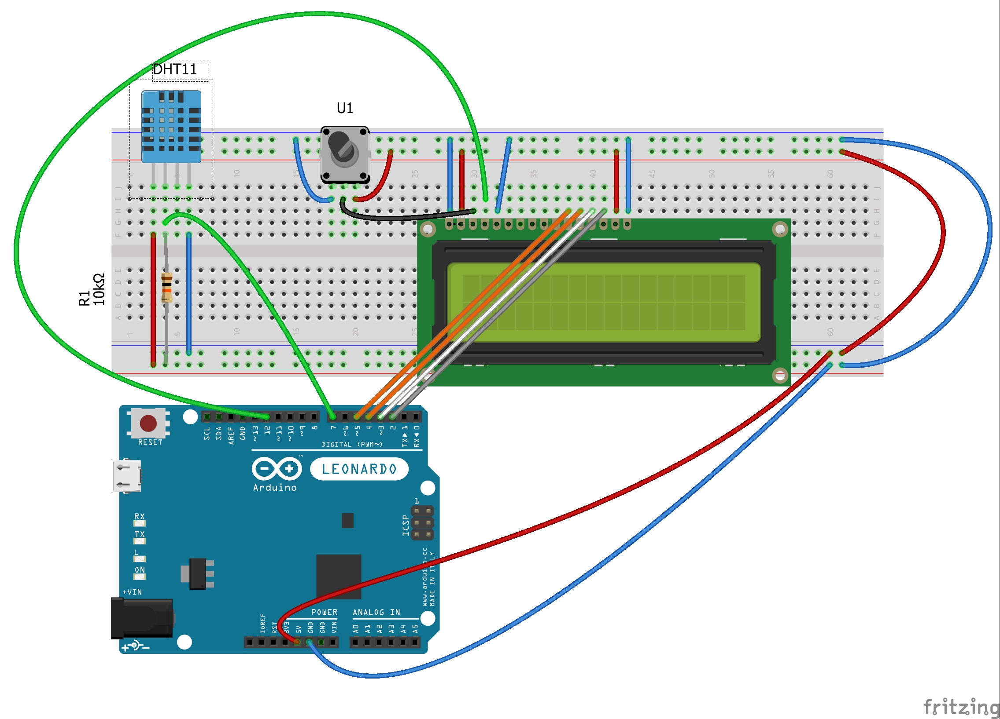

# Temp_And_humid
# Temperatur och Luftfuktighetssensor
## Inledning 
En temperatur- och luftfuktighetssensor är en enhet som mäter och registrerar temperaturen och luftfuktigheten i en given miljö. Dessa sensorer kan användas i en mängd olika applikationer, såsom övervakning av temperatur och luftfuktighet i ett växthus, ett förråd eller ett kontorsutrymme.
För att använda en temperatur- och fuktighetssensor med en Arduino, måste du ansluta sensorn till Arduino-kortet med hjälp av kablar. Det finns många olika typer av temperatur- och luftfuktighetssensorer tillgängliga, för att kommunicera med arduio.

## Komponenter
* Arduino Uno.
* DHT11 Sensor (Temperatur och luftfuktighetssensor).
* Breadboard.
* Kablar.
* LCD skärm.
* Resistorer 10K
* MongoDB Database
#### Bild på Komponenter kopplade

## Beskrivning
När sensorn är ansluten till Arduino kan du använda Arduinos programmeringsspråk (vanligtvis C++ eller en variant av det) för att läsa temperatur- och luftfuktighetsvärdena från sensorn. Du kan sedan använda denna data för en mängd olika ändamål, som att visa den på en LCD-skärm, logga den till en fil eller skicka den till en fjärrserver för lagring och analys.
För att lagra temperatur- och fuktighetsdata i en MongoDB-databas måste du installera MongoDB-databasprogramvaran på en dator eller server och ställa in en databasanslutning från Arduino till MongoDB-servern. När anslutningen är upprättad kan du använda Arduinos programmeringsspråk för att infoga temperatur- och fuktighetsdata i databasen som dokument.
## Visualisering
![Bild!] (Linjediagram_temperatur_humidity.png)

Denna kod kommer att ansluta till MongoDB-servern på IP-adressen 192.168.1.10 på port 27017, och sedan infoga ett nytt dokument i sensor_data-insamlingen för varje temperatur- och fuktighetsmätning som tas av sensorn. Dokumentet kommer att innehålla temperatur- och luftfuktighetsvärdena samt en tidsstämpel som anger när mätningen gjordes.

Du kan sedan använda verktyg som MongoDB Compass eller MongoDB-skalet för att fråga och analysera data som lagras i databasen.
## Kommunikation
* Seriell kommunikation: Ett alternativ är att använda seriell kommunikation för att skicka data från Arduino till en dator och sedan låta datorn lagra data i en databas. För att göra detta kan du använda Arduinos seriella bibliotek för att skicka data som en sträng över en USB-anslutning till datorn. På datorn kan du använda ett programmeringsspråk som Python för att läsa data från serieporten och lagra dem i en databas.
* Direktanslutning: Om Arduino och databasen är på samma nätverk kan du ansluta till databasen direkt från Arduino med hjälp av ett bibliotek som MySQL Connector/Arduino. Detta gör att du kan skicka SQL-kommandon till databasen för att lagra och hämta data.
* HTTP requests: HTTP-förfrågningar: Ett annat alternativ är att använda HTTP-förfrågningar för att skicka data från Arduino till en databasserver. För att göra detta kan du använda Arduinos Ethernet- eller WiFi-bibliotek för att skicka HTTP POST- eller GET-förfrågningar till en server som kör en databas. Servern kan sedan lagra data i databasen.
* Vi kommer också att behöva skapa tabeller och definiera strukturen för de data som kommer att lagras.
Så i slutet kommer vi behöva två skript en av de ska va på databas och den andra är som läser och skickar till databas. 
## Arkitektur översikt 
 
